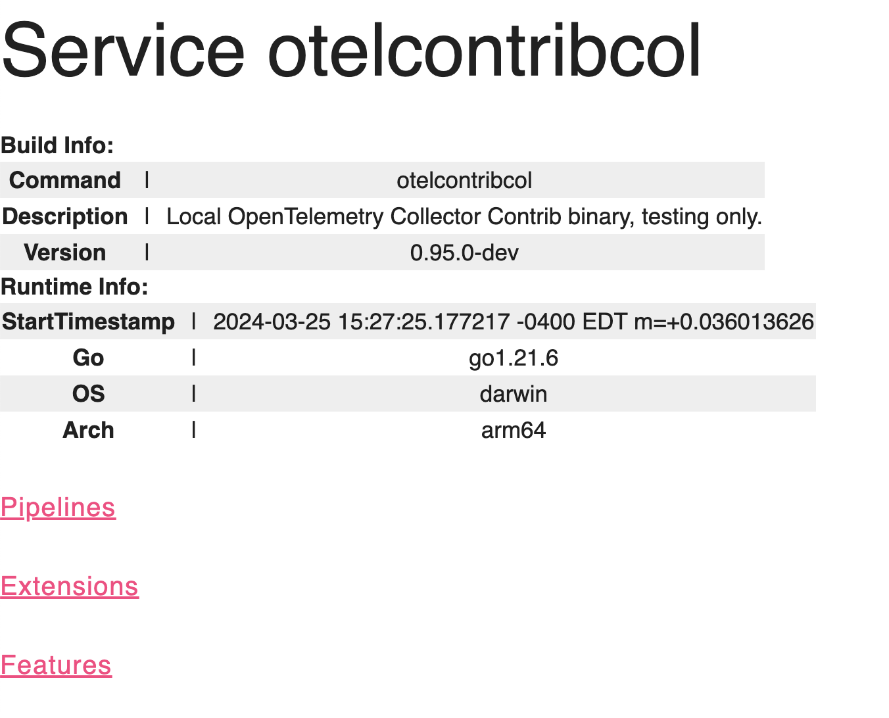

## Simple otelcontribcol Configuration

Configuration of the collector is broken down into 
FIVE Parts:

- Services
  - Binds Receivers and Exporters
- Receivers
  - Receiver or Scrape Data
  - A receiver is how data gets into the OpenTelemetry Collector. Generally, a receiver accepts data in a specified format, translates it into the internal format and passes it to processors and exporters defined in the applicable pipelines.
- Processors
  - Update Data
- Exporters
  - Send Data Downstream 
- Extensions
  - Utilities for the Collector
  - Typically,has an HTTP interface
- Connectors
  - A connector is both an exporter and receiver. As the name suggests a Connector connects two pipelines: it consumes data as an exporter at the end of one pipeline and emits data as a receiver at the start of another pipeline. It may consume and emit data of the same data type, or of different data types. A connector may generate and emit data to summarize the consumed data, or it may simply replicate or route data.


<table border="1">
<tr>
  <th>Name</th> <th>opentelemetry-collector</th> <th>opentelemetry-collector-contrib</th>
</tr>
<tr>
  <td>Service</td>
  <td><a href="https://github.com/open-telemetry/opentelemetry-collector/tree/main/service>">Default</a></td> 
  <td>N/A</td>

</tr>
<tr>
  <td>Exporter</td>
  <td><a href="https://github.com/open-telemetry/opentelemetry-collector/tree/main/exporter>">Default</a></td> 
  <td><a href="https://github.com/open-telemetry/opentelemetry-collector-contrib/tree/main/exporter>">Default</a></td>

</tr>
<tr>
  <td>Receiver</td>
  <td><a href="https://github.com/open-telemetry/opentelemetry-collector/tree/main/receiver>">Default</a></td> 
  <td><a href="https://github.com/open-telemetry/opentelemetry-collector-contrib/tree/main/receiver>">Default</a></td>

</tr>
<tr>
  <td>Extensions</td>
  <td><a href="https://github.com/open-telemetry/opentelemetry-collector/tree/main/extension>">Default</a></td> 
  <td><a href="https://github.com/open-telemetry/opentelemetry-collector-contrib/tree/main/extension>">Default</a></td>
</tr>
<tr>
  <td>Processor</td>
  <td><a href="https://github.com/open-telemetry/opentelemetry-collector/tree/main/processor>">Default</a></td> 
  <td><a href="https://github.com/open-telemetry/opentelemetry-collector-contrib/tree/main/processor>">Default</a>
  </td>
</tr>
<tr>
  <td>Connector</td>
  <td><a href="https://github.com/open-telemetry/opentelemetry-collector/tree/main/conector>">Default</a></td> 
  <td><a href="https://github.com/open-telemetry/opentelemetry-collector-contrib/tree/main/conector>">Default</a>
  </td>
</tr>
<tr>
  <td>Examples</td> 
  <td><a href="https://github.com/open-telemetry/opentelemetry-collector/tree/main/examples>">Default</a></td> 
  <td><a href="https://github.com/open-telemetry/opentelemetry-collector-contrib/tree/main/examples>">Default</a>
  </td>
</tr>
</table>
## Services

https://github.com/open-telemetry/opentelemetry-collector/tree/main/service
https://github.com/open-telemetry/opentelemetry-collector-contrib/tree/main/service

## Receivers
There are [many receivers alreay built](https://github.com/open-telemetry/opentelemetry-collector-contrib/tree/main/receiver) for capturing data from an enterprise resources.  
The [default receivers](https://github.com/open-telemetry/opentelemetry-collector/tree/main/receiver) in the opentelemetry-collector There are receviers for virtually everything.  

## Exporters
Exporters [many exporters alreay built](https://github.com/open-telemetry/opentelemetry-collector-contrib/tree/main/exporter) for pushing data to collection points
 
The [Default exporters](https://github.com/open-telemetry/opentelemetry-collector/tree/main/exporter) in the opentelemetry-collector
## Processors
Ther are two default

https://github.com/open-telemetry/opentelemetry-collector/tree/main/processor
https://github.com/open-telemetry/opentelemetry-collector-contrib/tree/main/processor

## Extensions : 
https://github.com/open-telemetry/opentelemetry-collector/tree/main/extension
https://github.com/open-telemetry/opentelemetry-collector-contrib/tree/main/extension

### Performance Profiler
[Performance Profiler](https://github.com/open-telemetry/opentelemetry-collector-contrib/blob/main/extension/pprofextension/README.md) :
Performance Profiler extension enables the golang net/http/pprof endpoint. This is typically used by developers to collect performance profiles and investigate issues with the service.

[http://localhost:1777/debug/pprof/](http://localhost:1777/debug/pprof/)
### Health Check
Heath Check:
[http://localhost:13133](http://localhost:13133)

Returns : 
```
{"status":"Server available","upSince":"2024-03-25T15:27:25.183526-04:00","uptime":"17m49.470455792s"}
```
### zPages
[http://localhost:55679/debug/servicez](http://localhost:55679/debug/servicez)


 